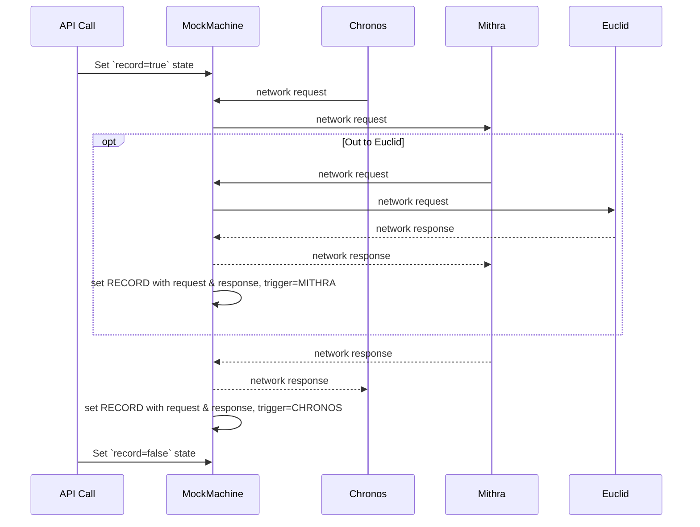
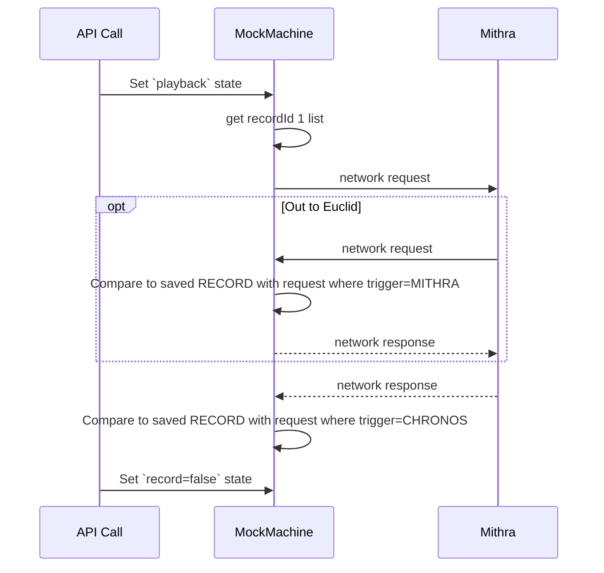

## Mocking REST API machine

#### Challenges
Mocking the test using a system that can create the test, and the results and check for consistency over the commit history between QA cycles 

1. More Mithra server integration tests.
We would like to run more tests on the systems then there are today
2. Continues Integration on demand test.
Execute tests as part of our CI/CD system
3. Ultra fast execution of test package.
To be usable tests needs to be execute fast and give results fast
4. Remove dependency for BackEnd (Euclid) and FrontEnd (Mithra).
On executing test package it should have more granularity to find specific faulty commits
5. Atomizing the test creation.
Have as less maintenance as possible for tests creation
6. Atomizing the test execution.
Test should should be executed automatically 

#### Solution overview
Solution will be based on recording QA scenarios in different chosen calls, and record their http requests and responses

* Proxying
  All calls to and from Mithra & Chronos will redirect through proxy
* Tests recording state
  QA tests REST calls recording (HTTP request/response)
* Playback state
  Playback state for QA execution recording
* Test Report
  Output a detailed execution report

#### Disclaimer
Solution assumes all network is HTTP REST.
QA scenarios that trigger different network types (aka WebSocket, Selery), Is not handled with current solution.

#### Proxying

##### The Challenge
A standalone service that will get all communication going IN and OUT of the proxied server.
The service will support an IN/OUT ports for communication.

##### Solution
This will be a standalone service in container.
Configuration for setting incoming & outgoing ports.
Chronos service will be configured to connect the Proxy service instead of Mithra in testing environment.


#### Test Recording

##### The Challenge
All network passes in the proxy need to be recorded, while a real QA scenarios is executed on environment.
The Recording mechanism should be able to be triggered, and not record everything.
We might not want to record Different QA stages (for example, fetching Login URL first time).

##### Solution
An API endpoint will be available for triggering "Record state".
Only on calling the end point with parameter: `record=true`, the record will start, with a new recordId.
On calling api with parameter: `record=false`, record will stop.
All network will be saved to DB, by the order they proxied, with direction (incoming/outgoing).
Direction will be used later for knowing what needs to be sent, and what need to be diff-ed.


DB Table network (json):
```json
{
  time: Date,
  recordId: "string",
  trigger: CHRONOS / MITHRA,
  request: reqObject,
  response: resObject,
  
}
```

#### Testing execution

##### The Challenge
Playback recorded network records saved on Mithra, with disconnecting the need on Chronos and Euclid. Executing One by one, and comparing returned results to the recorded ones.

##### Solution
Save records will be replayed where saved network triggered by Chronos will be triggered by proxy the `request`, and on response from Mithra, it will be compared to `response`.
Network recorded triggered by Mithra, will be first compared to the `request`, and the will be automatically resourced with the `response`.

An API endpoint will be available to trigger Test state execution.


### Recording State Sequence Diagram



### Playback State Sequence Diagram

